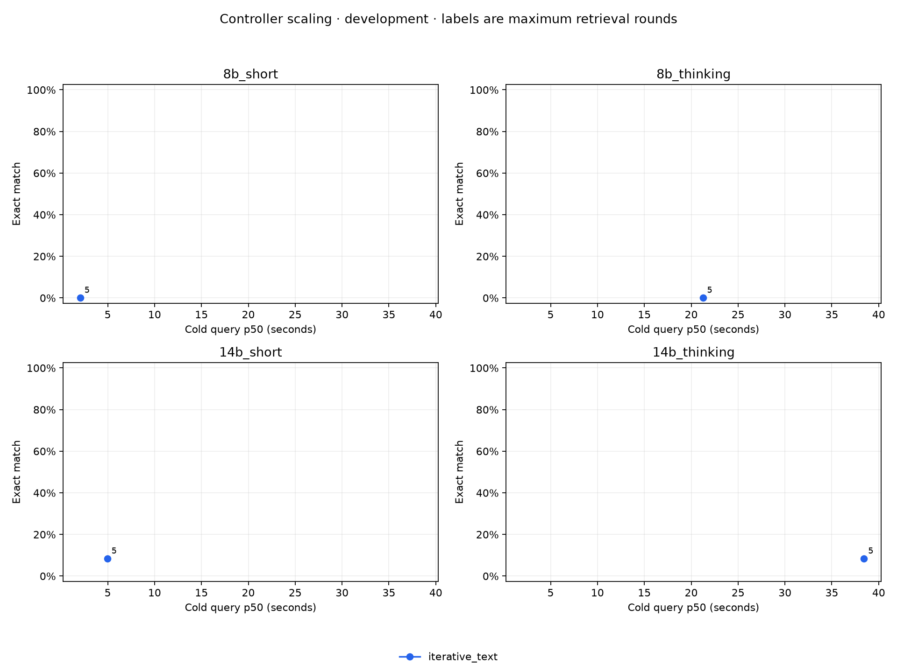
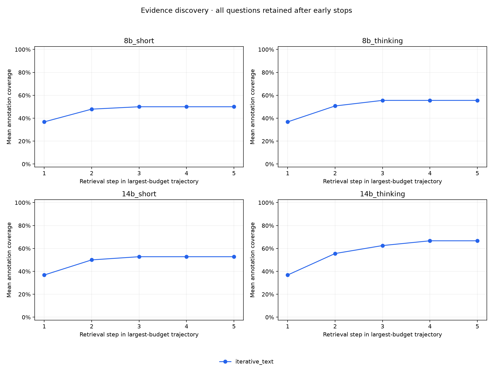
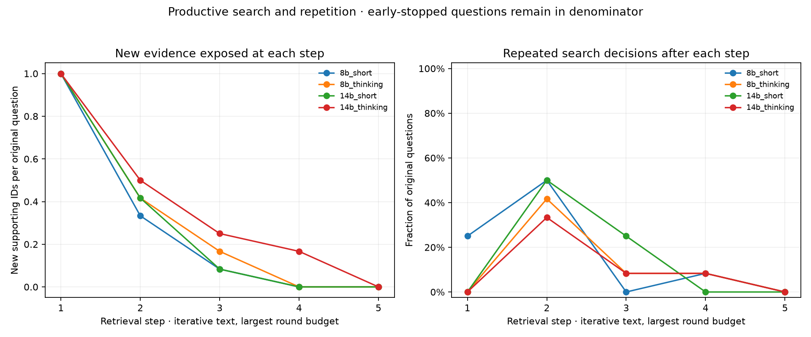

# Controller scaling — development

Every headline condition passed exact source, input, job, score and trace verification.

Cold timings include all online query work. Loading and index setup are separate in `summary.json`. Token counts are measured work, not dollar prices.

| Job | Arm | Round cap | Correct / n | F1 | Cold p50 / p95 (s) | Mean reasoning / action / host tokens | New support after first retrieval |
|---|---|---:|---:|---:|---:|---:|---:|
| 8b_short | iterative_text | 5 | 0 / 12 | 0.00% | 2.075 / 4.922 | 0.0 / 29.3 / 1.2 | 0.417 |
| 8b_thinking | iterative_text | 5 | 0 / 12 | 0.00% | 21.249 / 41.720 | 594.7 / 38.2 / 2.0 | 0.583 |
| 14b_short | iterative_text | 5 | 1 / 12 | 9.44% | 4.959 / 7.636 | 0.0 / 28.5 / 4.2 | 0.500 |
| 14b_thinking | iterative_text | 5 | 1 / 12 | 8.33% | 38.434 / 77.481 | 575.8 / 26.2 / 2.1 | 0.917 |

Detailed paired results are in [pairs.csv](pairs.csv); budget and model contrasts keep exactly the same question IDs. Each difference is target minus comparator and each latency ratio is target divided by comparator.

Round-by-round full-cohort and reached-round denominators are in [trajectories.csv](trajectories.csv). Per-question supporting-ID discovery is in [productivity.json](productivity.json).

## Limits

- This is a paired fixed subset of MuSiQue's development-source questions, not a population sample of all large-store queries. Development cohorts cannot establish held-out gains.
- Nominal question-level bootstrap/Wilson intervals are descriptive and unadjusted for multiple comparisons or shared source facts; they do not establish population superiority.
- New supporting IDs measure annotation exposure after inference. A delivered paragraph may be truncated, and exposure does not prove understanding, use, or causal necessity.
- Early stops contribute zero new support at later rounds; cumulative coverage is carried forward. Reached-round productivity has a selected denominator and is descriptive.
- Each configured round budget runs a separate adaptive trajectory. Accuracy at intermediate steps is not observed unless a separate run ends at that budget.
- Cold query latency includes retrieval, controller reasoning/action decoding, per-question tokenization, cache construction and final generation. Model loading and offline index setup are separate.
- Token work, sampled RSS and MLX allocator peaks are resource measures, not dollar cost or measured energy. Peak allocator values may carry earlier jobs' high-water marks within a process.
- Each model uses its own freshly constructed KV caches. Checkpoints have incompatible caches; no cross-model cache sharing or transfer is evaluated.
- Reasoning remains decoded text; there is no trained latent query head, learned compressor, or ingestion-precomputed whole-corpus KV store in this experiment.

## Figures

