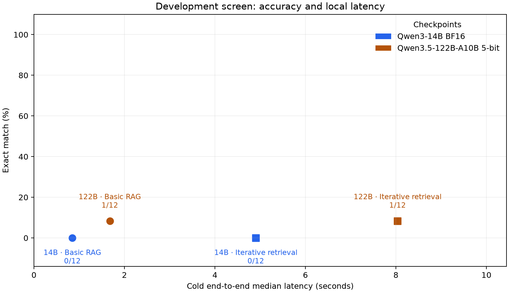
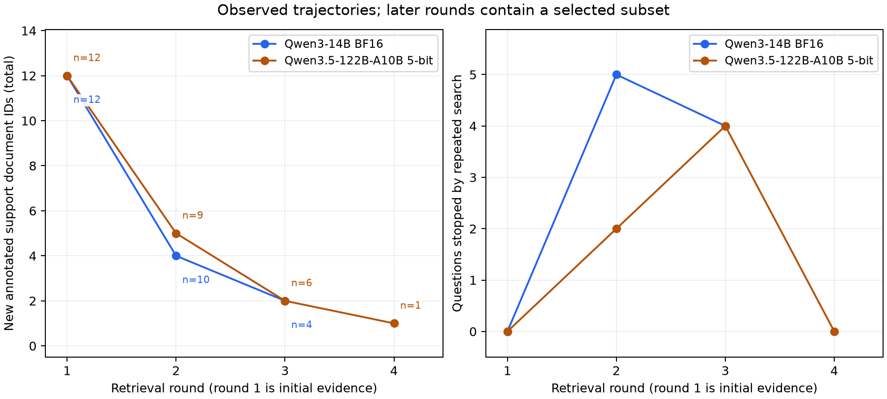

# Large-controller screen and infrastructure latency scenarios

September 11, 2026. All 48 new conditions completed on a 128 GiB M5 Max. The
Qwen3.5-122B-A10B 5-bit checkpoint fits the machine and completes short retrieval
decisions without explicit thinking. It recovers one clearly grounded four-hop
answer that basic RAG misses, while the unchanged exact-match metric remains
1/12 in both arms. This is an encouraging development example, not a reliable
accuracy gain or a demonstrated latent-memory advantage.

## Measured results

| Model | Method | Exact match / 12 | F1 | Local median / p95 (s) | New annotated supports | Complete annotated sets / 12 |
| --- | --- | ---: | ---: | ---: | ---: | ---: |
| Qwen3-14B BF16 | Basic RAG | 0 | 0.0% | 0.85 / 0.97 | 0 | 1 |
| Qwen3-14B BF16 | Iterative text | 0 | 0.0% | 4.90 / 7.91 | 6 | 1 |
| Qwen3.5-122B-A10B 5-bit | Basic RAG | 1 | 12.5% | 1.68 / 5.65 | 0 | 1 |
| Qwen3.5-122B-A10B 5-bit | Iterative text | 1 | 19.0% | 8.04 / 13.36 | 8 | 3 |



The twelve previously inspected development questions share a 21,100-paragraph
BM25 corpus. The prepared 96-question test split remains unused. Basic RAG takes
six paragraphs once; iterative retrieval can add three per search, with five
rounds and eighteen documents maximum. Both native chat templates disable
thinking. Controllers receive 32 tokens with seeded sampling; final answers use
a separate greedy 48-token call. Context and document limits are shared.

Query timing includes fresh call caches, retrieval, tokenization and generation
with the model loaded once per job. Model load and offline index setup are
separate. The first 122B basic call takes 9.66 seconds, including first-call
compilation/paging. Small-sample p95 is descriptive. Both guarded jobs together
take 4 minutes 17 seconds, excluding download and synthetic preflights. Peak MLX
allocation is 28.04 GiB for 14B and 78.97 GiB for 122B. All guards and inference
processes complete normally; no system memory limits are changed.

## Evidence and failure analysis

The [complete qualitative audit](qualitative-audit.md) examines all twelve
questions and all 48 outputs using retained evidence fragments. The
[machine-readable audit](qualitative-audit.json) preserves exact witnesses and
query sequences.

- The 122B controller connects Papa Roach/California and Veoh/San Diego, then
  retrieves the urban-area rank. All four relevant paragraphs are delivered.
  Basic RAG gives UNKNOWN; iterative gives “Third.” The supplied alias is
  “third-largest,” so unchanged exact match and F1 score this recovery zero.
- Both 122B arms correctly answer 1848 from initial non-annotated evidence, where
  14B abstains. Annotation coverage alone misses that available answer.
- Iterative 122B improves two outputs to grounded years, 2012 and 1642, while
  omitting the requested month/full date. It also emits an unsupported 1968
  answer from an Austria distractor and copies Medical College of Georgia for
  a question whose chain targets Warsaw.
- Taxonomic-rank and employer ambiguity affect two aliases. A purported spouse
  support paragraph does not establish marriage. The Luther→Wittenberg relation
  is outside the retained 300-token fragment. These are distinct evidence,
  labeling and answer-use failures.

No scores are silently changed. The qualitative interpretation is posthoc, not
blinded semantic regrading. No controller cap, invalid action or final search
command leak occurs in the new screen. Repeated-query stops fall from 9/12 for
14B to 6/12 for 122B. Model family, training, architecture, tokenizer and precision
change together, so this is not an isolated parameter-count comparison.



## Infrastructure-adjusted latency

The [full provider adjustment](provider-latency/provider-latency.md) covers the
96 original conditions from the new and preceding controller screens: 254
logical model calls, fourteen profiles and 408 condition/profile calculations.
They reuse twelve questions. It preserves actual local outputs and counts, then
substitutes sourced call-time scenarios; no hosted inference is run.

For the cached Alibaba 122B profile, projected mean latency is 0.99 seconds basic
and 3.46 seconds iterative under the decode-rate assumption, versus measured
local means of 2.37 and 8.11 seconds. Cached latency is assumed to be TTFT and its
throughput definition is ambiguous; the distinct inclusive-rate proxy gives
0.98 and 3.23 seconds. The 122B table is a historical cached observation.
[Published provider table](https://openrouter.ai/qwen/qwen3.5-122b-a10b/benchmarks).

Applying Lambda's 4× B200/SGLang mean TTFT and TPOT to the saved short calls gives
1.18 seconds basic and 4.17 seconds iterative. Its source workload uses 8192-token
inputs, 1024-token outputs and concurrency 32, so these are conditional
extrapolations. All six hardware/engine pairs appear in the appendix.
[Hardware calibration](https://lambda.ai/inference-models/qwen/qwen3.5-122b-a10b).


These are not measured provider results, confidence intervals or a universal
hardware adjustment. Provider accuracy is not inferred from local accuracy.
Original KV-relay/cache methods are excluded because ordinary text APIs cannot
execute their cache operations. No dollar-cost or energy saving is established.

## Reproduction and provenance

Runtime source: commit `9d52b58`. Code and reporting changes:
[PR #5](https://github.com/mattquest/latent-memory/pull/5). Later reporting changes
do not alter generation. The first exporter rejected an MLX-LM 0.31.3 RoPE key
normalization; its failed receipt and exact original exporter are archived. The
repair accepts only that architecture/version-specific rename and validates all
remaining configuration fields. All 446 CPU tests pass; strict export verifies
48/48 conditions without loading model weights.

- [Protocol](../../docs/large-controller-protocol.md) and
  [execution matrix](../../configs/large-controller-screen.json).
- [Summary and verification status](summary.json), [metrics CSV](metrics.csv),
  [paired comparisons](paired-comparisons.csv), [trajectories](trajectories.csv)
  and [condition-level report](conditions.json).
- [Artifact manifest](artifact-manifest.json): packed and unpacked hashes for raw
  model runs, every executed source, native prompts/token ledgers, inputs,
  checkpoint metadata, resource guards, prior-screen sources and projection code.
- [Projection inputs and outputs](provider-latency/provider-latency.md#artifacts-and-reproduction),
  [curated source facts](provider-latency/published-source-observations.json),
  and source-fetch receipts. Full third-party webpages and model weights are not
  redistributed.
- [Published root README snapshot](published-readme.md) and
  [publication manifest](publication-manifest.json). The snapshot is a byte-level
  record; its repository-relative links are intended for the repository root.
- [Dataset attribution](DATA_LICENSE.md). MuSiQue is CC BY 4.0; normalized inputs
  and selection provenance are archived.

Verify all published bytes, archived sources, source-result identities and
provider calculations using only Python's standard library:

```sh
python reports/2026-09-11-large-controller/verify_publication.py
```

Add `--check-current-readme` to compare the repository's current README with this
publication's snapshot. Default verification remains valid after future README
edits. To rebuild from restored local sources and pinned checkpoint metadata:

```sh
.venv/bin/python scripts/build_large_controller_report.py --require-complete
.venv/bin/python scripts/project_controller_latency.py --profiles runs/large-controller/provider-latency/profiles.json
```

The exporter rebuilds core empirical artifacts, not the hand-audited publication
text and final inventory. Provider inputs are frozen source observations, not
live API requests. Their exact paths and hashes are retained. A fresh provider
measurement should create a new dated profile rather than overwrite this report.
