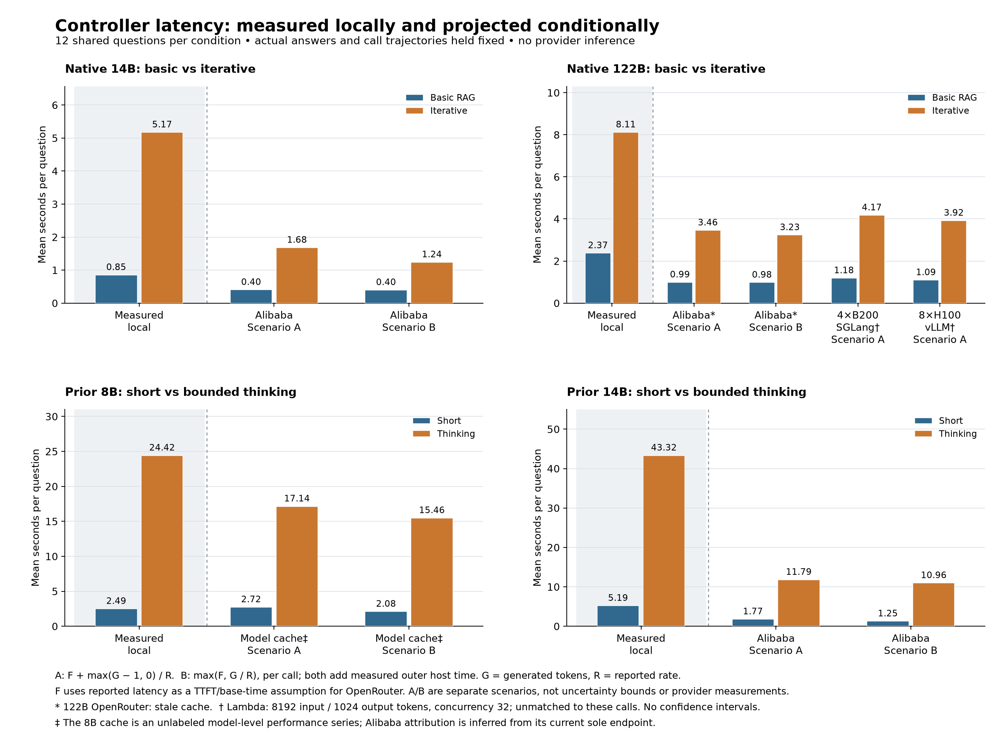

# Conditional provider latency for the two controller screens

This analysis keeps the recorded answers, retrieval decisions and token workloads fixed, then substitutes published provider or hardware timing profiles. It is a latency sensitivity analysis; no hosted inference was run and no provider accuracy was measured.

There are **12 distinct development questions**, reused in 96 local conditions: 48 native basic/iterative conditions and 48 earlier short/bounded-thinking conditions. The 14 profiles produce 408 condition/profile calculations, 34 summary groups and 17 paired comparisons. These are repeated calculations on the same questions, not 408 independent subjects. All six published Lambda hardware/engine combinations are included below.

## Selected means

Every entry is a mean in seconds per question over the same 12 questions. “Local” is measured local latency; A and B are projected scenarios. Native and earlier screens use different controller prompts and cannot be treated as one experiment.

| Screen and condition | Measured local | Cached profile A | Cached profile B | Local exact matches |
| --- | ---: | ---: | ---: | ---: |
| Native 14B basic | 0.852 | 0.401 | 0.396 | 0/12 |
| Native 14B iterative | 5.173 | 1.679 | 1.238 | 0/12 |
| Native 122B basic | 2.372 | 0.985 | 0.975 | 1/12 |
| Native 122B iterative | 8.114 | 3.455 | 3.231 | 1/12 |
| Prior 8B short | 2.485 | 2.725 | 2.084 | 0/12 |
| Prior 8B thinking | 24.416 | 17.137 | 15.465 | 0/12 |
| Prior 14B short | 5.192 | 1.766 | 1.250 | 1/12 |
| Prior 14B thinking | 43.317 | 11.791 | 10.956 | 1/12 |

These selected cached profiles use Alibaba for 14B and 122B. For 8B, the source is an unlabeled cached model-level performance series: attribution to Alibaba is inferred from the current sole endpoint and is not a measured historical Alibaba pair. The Alibaba 122B values use a stale cached provider table. Under Lambda's six distinct hardware calibrations, native 122B projected A means span 1.091–7.663 s for basic and 3.920–26.205 s for iterative. These endpoints are different scenarios, not an uncertainty interval or a provider ranking. Some calibrations are slower than the measured local runs.



The figure selects cached Alibaba profiles for 14B/122B, the 8B model-level series and two Lambda configurations to keep it readable. The appendix retains every profile and result group; the selection is not a claim that these providers or engines are best.

## Token and timing definitions

Let H be measured time outside the local model-call windows, F the profile's TTFT (or cached latency used as its proxy), R its reported token rate, and Gᵢ the recorded generated tokens in logical call i. The two calculations are:

- **A — decode-rate assumption:** H + Σᵢ[F + max(Gᵢ − 1, 0) / R].
- **B — inclusive-rate proxy:** H + Σᵢ max(F, Gᵢ / R). This is emitted only when the reported throughput convention is ambiguous.

A and B are separate what-if scenarios, not confidence intervals, bounds, or measured provider latency. Lambda publishes mean time per output token (TPOT), so R = 1000 / TPOT_ms and only A is used. Taking the inverse of the reported mean TPOT is a constant-rate scenario; it is not a measurement of the mean reciprocal rate across requests.

G includes generated reasoning (including a generated end-think delimiter), action text and final-answer tokens. Sampled EOS tokens and forced input controls are excluded. Reasoning and action belong to one logical controller call; a forced phase closure is a separate input segment, not an extra request. All 254 logical calls are preserved. The earlier final decoder did not save EOS IDs; its sampled-token count is derived from its saved stop reason, and this derivation does not affect G.

Local means use saved cold end-to-end times. Each query constructs and processes its context afresh; the model and retrieval index are already loaded. They include retrieval, per-case preparation, controller calls, final generation and measured host overhead; they exclude model loading and shared index setup. Native and earlier timing wrappers differ, so their measured means remain separate. The provider scenarios retain only measured outer host work plus the substituted call formula. Within-call host work, EOS termination and forced-closure prefill latency are not modeled separately.

No additional input-token/rate term is added: the supplied TTFT already contains unmatched prompt processing and, depending on source, queue/network work. There is no fitted prefill scaling law. Saved prefill counts remain in the workload ledger. Across the native 122B calls, initial prompts contain 762–2125 tokens and generated outputs contain 1–18 tokens; this differs sharply from Lambda's 8192/1024-token, concurrency-32 workload. The exact bounded reasoning/forced closure protocol would require custom server support and may not be reproducible with an ordinary chat API.

## Source limits

The [8B OpenRouter page](https://openrouter.ai/qwen/qwen3-8b/pricing) and [14B OpenRouter page](https://openrouter.ai/qwen/qwen3-14b-04-28/uptime) provide cached averages of displayed one-week P50 series, with nearby availability displays ending September 10; exact performance-week boundaries and timezone are unknown. The [122B OpenRouter provider table](https://openrouter.ai/qwen/qwen3.5-122b-a10b/benchmarks) was marked crawled last month and exposes no exact aggregation dates. Its profiles are historical sensitivity scenarios, not current service estimates. Retrieval date is September 11, 2026; it is not the performance measurement date.

OpenRouter's [provider integration guide](https://openrouter.ai/docs/guides/community/for-providers) and [latency/performance guide](https://openrouter.ai/docs/guides/best-practices/latency-and-performance) use differing throughput descriptions, motivating A/B. Cached pages also describe their latency label ambiguously; using it as F is an assumption. Current unauthenticated endpoint responses had null performance fields, which were not converted to zero or combined with unrelated fresh metrics. Means of the projected question workloads are not provider mean latencies or provider P50/P95 estimates.

[Lambda's benchmark](https://lambda.ai/inference-models/qwen/qwen3.5-122b-a10b) supplies separate mean TTFT and TPOT for 512 requests with 8192 input tokens, 1024 output tokens and maximum concurrency 32. It is a hardware calibration, not a measured serverless endpoint for these short requests. Its execution date, precision and exact engine revisions are unspecified. The six configurations remain separate; aggregate cluster token throughput is not used as single-request decode speed.

Profiles match explicit model families, not identical checkpoints or execution. The local 122B model is a 5-bit conversion, and provider precision, sampling, templates and reasoning policies may differ. Such differences can change answers and search trajectories. This report retains the unchanged repository exact-match scorer and supplied aliases for local outputs only; it does not transfer that accuracy to a provider. Sparse successes on 12 development questions do not establish quality equivalence.

Original KV relay, incremental-cache and pressure experiments are excluded: ordinary chat APIs do not expose their cache operations. These calculations therefore cover the 96 controller-screen conditions, not the earlier thousands of cache experiments.

## Workload appendix

Counts are totals across 12 questions per row. Initial prefill excludes forced control input; sampled EOS is shown separately from generated text in the machine-readable ledger.

| Run / arm | Logical calls | Initial prefill tokens | Forced input tokens | Generated reasoning | Generated action | Generated final |
| --- | ---: | ---: | ---: | ---: | ---: | ---: |
| native/122b / basic_rag | 12 | 11282 | 0 | 0 | 0 | 24 |
| native/122b / iterative_text | 40 | 53119 | 0 | 0 | 274 | 33 |
| native/14b / basic_rag | 12 | 11106 | 0 | 0 | 0 | 15 |
| native/14b / iterative_text | 38 | 48673 | 0 | 0 | 326 | 15 |
| prior/14b_short / iterative_text | 39 | 53332 | 0 | 0 | 342 | 50 |
| prior/14b_thinking / iterative_text | 39 | 54357 | 79 | 6910 | 314 | 25 |
| prior/8b_short / iterative_text | 34 | 44728 | 0 | 0 | 352 | 14 |
| prior/8b_thinking / iterative_text | 40 | 55972 | 82 | 7136 | 459 | 24 |

## All 14 profiles

F is TTFT for Lambda and reported cached latency assumed to be TTFT/base time for OpenRouter, in seconds. R is reported tokens/s; for Lambda it is inverse mean TPOT. OpenRouter profiles support A/B; Lambda profiles support A only. The 8B model-level series has inferred Alibaba attribution. Source links identify each retained rate/latency pair.

| Profile ID | Model | Provider / configuration | F (s) | R (tok/s) | Scenarios | Source |
| --- | --- | --- | ---: | ---: | --- | --- |
| openrouter14b-alibaba | Qwen3-14B | Alibaba | 0.380 | 57.000 | A/B | [openrouter14b](https://openrouter.ai/qwen/qwen3-14b-04-28/uptime) |
| openrouter14b-nextbit | Qwen3-14B | NextBit | 0.750 | 50.000 | A/B | [openrouter14b](https://openrouter.ai/qwen/qwen3-14b-04-28/uptime) |
| openrouter14b-deepinfra | Qwen3-14B | DeepInfra | 0.830 | 43.000 | A/B | [openrouter14b](https://openrouter.ai/qwen/qwen3-14b-04-28/uptime) |
| openrouter8b-alibaba | Qwen3-8B | Alibaba (inferred; cached model-level series) | 0.730 | 43.000 | A/B | [openrouter8b](https://openrouter.ai/qwen/qwen3-8b/pricing) |
| openrouter122b-siliconflow | Qwen3.5-122B-A10B | SiliconFlow | 1.490 | 30.000 | A/B | [openrouter122b](https://openrouter.ai/qwen/qwen3.5-122b-a10b/benchmarks) |
| openrouter122b-alibaba | Qwen3.5-122B-A10B | Alibaba | 0.960 | 99.000 | A/B | [openrouter122b](https://openrouter.ai/qwen/qwen3.5-122b-a10b/benchmarks) |
| openrouter122b-atlascloud | Qwen3.5-122B-A10B | AtlasCloud | 1.130 | 84.000 | A/B | [openrouter122b](https://openrouter.ai/qwen/qwen3.5-122b-a10b/benchmarks) |
| openrouter122b-novita | Qwen3.5-122B-A10B | Novita | 0.800 | 84.000 | A/B | [openrouter122b](https://openrouter.ai/qwen/qwen3.5-122b-a10b/benchmarks) |
| lambda122b-lambda-4xb200-sglang | Qwen3.5-122B-A10B | Lambda 4xB200 SGLang | 1.156 | 76.923 | A only | [lambda122b](https://lambda.ai/inference-models/qwen/qwen3.5-122b-a10b) |
| lambda122b-lambda-8xh100-vllm | Qwen3.5-122B-A10B | Lambda 8xH100 vLLM | 1.060 | 62.500 | A only | [lambda122b](https://lambda.ai/inference-models/qwen/qwen3.5-122b-a10b) |
| lambda122b-lambda-8xh100-sglang | Qwen3.5-122B-A10B | Lambda 8xH100 SGLang | 2.613 | 55.556 | A only | [lambda122b](https://lambda.ai/inference-models/qwen/qwen3.5-122b-a10b) |
| lambda122b-lambda-8xa100-sglang | Qwen3.5-122B-A10B | Lambda 8xA100 SGLang | 4.602 | 33.333 | A only | [lambda122b](https://lambda.ai/inference-models/qwen/qwen3.5-122b-a10b) |
| lambda122b-lambda-4xb200-vllm | Qwen3.5-122B-A10B | Lambda 4xB200 vLLM | 4.904 | 76.923 | A only | [lambda122b](https://lambda.ai/inference-models/qwen/qwen3.5-122b-a10b) |
| lambda122b-lambda-8xa100-vllm | Qwen3.5-122B-A10B | Lambda 8xA100 vLLM | 7.612 | 27.778 | A only | [lambda122b](https://lambda.ai/inference-models/qwen/qwen3.5-122b-a10b) |

## All 34 result groups

Each group has n = 12 questions. A/B values are projected **means**; the CSV additionally contains empirical p50/p95 across these same question workloads. Those percentiles describe workload variation, not uncertainty or provider service percentiles. Missing B means the TPOT source supports only A. Repeated local means identify the same local cohort and must not be pooled across profiles.

| Profile ID | Run / arm | n | Measured local mean (s) | Projected A mean (s) | Projected B mean (s) |
| --- | --- | ---: | ---: | ---: | ---: |
| lambda122b-lambda-4xb200-sglang | native/122b / basic_rag | 12 | 2.372 | 1.184 | — |
| lambda122b-lambda-4xb200-sglang | native/122b / iterative_text | 12 | 8.114 | 4.173 | — |
| lambda122b-lambda-4xb200-vllm | native/122b / basic_rag | 12 | 2.372 | 4.932 | — |
| lambda122b-lambda-4xb200-vllm | native/122b / iterative_text | 12 | 8.114 | 16.667 | — |
| lambda122b-lambda-8xa100-sglang | native/122b / basic_rag | 12 | 2.372 | 4.647 | — |
| lambda122b-lambda-8xa100-sglang | native/122b / iterative_text | 12 | 8.114 | 16.038 | — |
| lambda122b-lambda-8xa100-vllm | native/122b / basic_rag | 12 | 2.372 | 7.663 | — |
| lambda122b-lambda-8xa100-vllm | native/122b / iterative_text | 12 | 8.114 | 26.205 | — |
| lambda122b-lambda-8xh100-sglang | native/122b / basic_rag | 12 | 2.372 | 2.646 | — |
| lambda122b-lambda-8xh100-sglang | native/122b / iterative_text | 12 | 8.114 | 9.141 | — |
| lambda122b-lambda-8xh100-vllm | native/122b / basic_rag | 12 | 2.372 | 1.091 | — |
| lambda122b-lambda-8xh100-vllm | native/122b / iterative_text | 12 | 8.114 | 3.920 | — |
| openrouter122b-alibaba | native/122b / basic_rag | 12 | 2.372 | 0.985 | 0.975 |
| openrouter122b-alibaba | native/122b / iterative_text | 12 | 8.114 | 3.455 | 3.231 |
| openrouter122b-atlascloud | native/122b / basic_rag | 12 | 2.372 | 1.157 | 1.145 |
| openrouter122b-atlascloud | native/122b / iterative_text | 12 | 8.114 | 4.062 | 3.797 |
| openrouter122b-novita | native/122b / basic_rag | 12 | 2.372 | 0.827 | 0.815 |
| openrouter122b-novita | native/122b / iterative_text | 12 | 8.114 | 2.962 | 2.697 |
| openrouter122b-siliconflow | native/122b / basic_rag | 12 | 2.372 | 1.539 | 1.505 |
| openrouter122b-siliconflow | native/122b / iterative_text | 12 | 8.114 | 5.739 | 4.997 |
| openrouter14b-alibaba | native/14b / basic_rag | 12 | 0.852 | 0.401 | 0.396 |
| openrouter14b-alibaba | native/14b / iterative_text | 12 | 5.173 | 1.679 | 1.238 |
| openrouter14b-alibaba | prior/14b_short / iterative_text | 12 | 5.192 | 1.766 | 1.250 |
| openrouter14b-alibaba | prior/14b_thinking / iterative_text | 12 | 43.317 | 11.791 | 10.956 |
| openrouter14b-deepinfra | native/14b / basic_rag | 12 | 0.852 | 0.852 | 0.846 |
| openrouter14b-deepinfra | native/14b / iterative_text | 12 | 5.173 | 3.248 | 2.661 |
| openrouter14b-deepinfra | prior/14b_short / iterative_text | 12 | 5.192 | 3.397 | 2.713 |
| openrouter14b-deepinfra | prior/14b_thinking / iterative_text | 12 | 43.317 | 16.685 | 14.845 |
| openrouter14b-nextbit | native/14b / basic_rag | 12 | 0.852 | 0.771 | 0.766 |
| openrouter14b-nextbit | native/14b / iterative_text | 12 | 5.173 | 2.913 | 2.408 |
| openrouter14b-nextbit | prior/14b_short / iterative_text | 12 | 5.192 | 3.041 | 2.453 |
| openrouter14b-nextbit | prior/14b_thinking / iterative_text | 12 | 43.317 | 14.469 | 12.805 |
| openrouter8b-alibaba | prior/8b_short / iterative_text | 12 | 2.485 | 2.725 | 2.084 |
| openrouter8b-alibaba | prior/8b_thinking / iterative_text | 12 | 24.416 | 17.137 | 15.465 |

## Paired comparisons

The [paired CSV](provider-pairs.csv) contains all 17 profile-specific contrasts, each matching the same 12 question IDs. Positive mean differences mean the comparison took longer: iterative minus basic in the native screen, and thinking minus short in the prior screen. Ratios are medians of within-question comparison/baseline ratios, not ratios of cohort means. No confidence intervals are inferred from alternative providers or scenario A/B.

## Artifacts and reproduction

The [summary CSV](provider-summary.csv), [paired CSV](provider-pairs.csv), [workload ledger](workloads.json), [projection ledger](projections.json), [profiles](profiles.json), [curated source observations](published-source-observations.json) and [audit receipt](projection-audit.json) preserve all included computations. Source/result/data hashes are in the workload ledger; projection hashes pin the workload and profile inputs. Full third-party webpages and documentation are not redistributed with this report.

To regenerate the tables and figure from the released JSON ledgers, run from the repository root (no original run directories or model weights are needed):

```sh
.venv/bin/python reports/2026-09-11-large-controller/provider-latency/render_provider_report.py
```

To regenerate workloads and projections, first restore the six preserved source runs and normalized inputs as described in the parent report, then copy the released profile receipts and run:

```sh
mkdir -p runs/large-controller/provider-latency
cp reports/2026-09-11-large-controller/provider-latency/profiles.json reports/2026-09-11-large-controller/provider-latency/published-source-observations.json runs/large-controller/provider-latency/
.venv/bin/python scripts/project_controller_latency.py --profiles runs/large-controller/provider-latency/profiles.json
.venv/bin/python reports/2026-09-11-large-controller/provider-latency/render_provider_report.py --input-dir runs/large-controller/provider-latency
```

The renderer uses its own directory by default or an explicit `--input-dir`. It performs no network calls or inference. Regenerating projection inputs after changing the extraction script changes the extractor hash; preserve the released JSON files for exact replay of the reported calculations.
