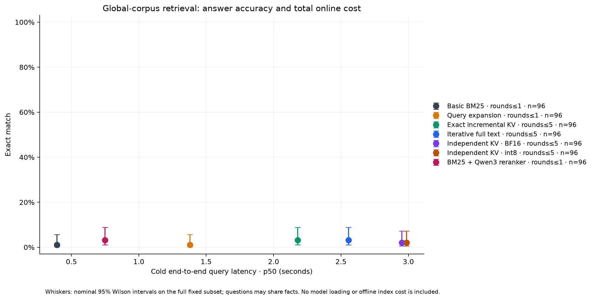
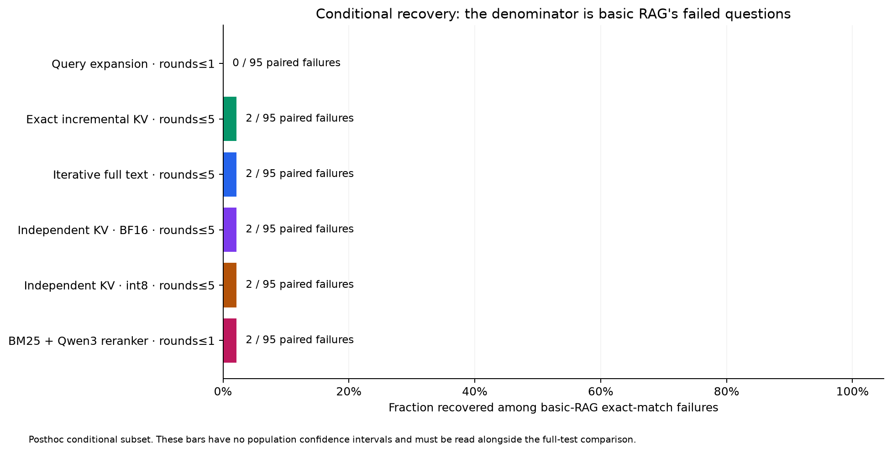

# Adaptive retrieval results

Status: **complete**

Cold timings include per-question tokenization, search, controller generation, cache construction and final generation. Model loading and the shared offline BM25 index are excluded and recorded in the manifest.

| Arm | Round cap | n | EM | F1 | Cold p50 / p95 (s) | Mean docs | Host / internal tokens |
| --- | --- | --- | --- | --- | --- | --- | --- |
| basic_rag | 1 | 96 | 1.0% | 2.4% | 0.39 / 1.36 | 6.0 | 4.7 / 0.0 |
| expanded_rag | 1 | 96 | 1.0% | 2.6% | 1.38 / 2.26 | 6.0 | 4.5 / 24.2 |
| incremental_kv_bf16 | 5 | 96 | 3.1% | 4.9% | 2.18 / 3.55 | 8.8 | 5.4 / 33.1 |
| iterative_text | 5 | 96 | 3.1% | 4.9% | 2.56 / 4.14 | 8.8 | 5.4 / 33.1 |
| relay_kv_bf16 | 5 | 96 | 2.1% | 3.8% | 2.95 / 4.90 | 8.5 | 1.5 / 33.1 |
| relay_kv_int8 | 5 | 96 | 2.1% | 3.8% | 2.99 / 5.03 | 8.5 | 1.5 / 32.6 |
| reranked_rag | 1 | 96 | 3.1% | 4.5% | 0.75 / 1.52 | 6.0 | 5.2 / 0.0 |

## Recovery where basic RAG failed exact match

This subset is defined after running basic RAG. It supplements the full-test table above.

| Arm | Round cap | Paired failures | Recovered | Recovery rate | Basic / enhanced cold p50 (s) |
| --- | --- | --- | --- | --- | --- |
| expanded_rag | 1 | 95 | 0 | 0.0% | 0.39 / 1.39 |
| incremental_kv_bf16 | 5 | 95 | 2 | 2.1% | 0.39 / 2.18 |
| iterative_text | 5 | 95 | 2 | 2.1% | 0.39 / 2.56 |
| relay_kv_bf16 | 5 | 95 | 2 | 2.1% | 0.39 / 2.99 |
| relay_kv_int8 | 5 | 95 | 2 | 2.1% | 0.39 / 2.99 |
| reranked_rag | 1 | 95 | 2 | 2.1% | 0.39 / 0.75 |

## Paired cache-method comparisons

Differences are target minus comparator on the same questions. Latency ratios are the median of per-question target/comparator ratios; below 1 means faster. JSON includes paired confidence intervals; constant differences have no estimated interval.

| Target | Comparator | Paired n | EM difference | F1 difference | Median cold latency ratio |
| --- | --- | --- | --- | --- | --- |
| incremental_kv_bf16 (5 rounds) | iterative_text (5 rounds) | 96 | +0.0 pp | +0.0 pp | 0.88 |
| incremental_kv_bf16 (5 rounds) | reranked_rag (1 rounds) | 96 | +0.0 pp | +0.4 pp | 2.88 |
| relay_kv_bf16 (5 rounds) | iterative_text (5 rounds) | 96 | -1.0 pp | -1.1 pp | 1.18 |
| relay_kv_bf16 (5 rounds) | reranked_rag (1 rounds) | 96 | -1.0 pp | -0.7 pp | 3.71 |
| relay_kv_bf16 (5 rounds) | incremental_kv_bf16 (5 rounds) | 96 | -1.0 pp | -1.1 pp | 1.30 |
| relay_kv_int8 (5 rounds) | iterative_text (5 rounds) | 96 | -1.0 pp | -1.1 pp | 1.20 |
| relay_kv_int8 (5 rounds) | reranked_rag (1 rounds) | 96 | -1.0 pp | -0.7 pp | 3.85 |
| relay_kv_int8 (5 rounds) | incremental_kv_bf16 (5 rounds) | 96 | -1.0 pp | -1.1 pp | 1.32 |

## Limits

- Global BM25 index and model loading are common offline setup; all per-question inference, retrieval and KV construction are charged.
- Iterative arms can retrieve more documents than the single-round baselines; improvements may come from additional evidence and model calls.
- All iterative controllers decode SEARCH/ANSWER actions. This is not a trained zero-text latent planner.
- Incremental KV is ordinary causal prefix reuse. Independent-document relay is separately labeled and may alter controller decisions.
- Primary-model prefill and all-model prefill totals are separate; all-model totals include every reranker input token when that optional arm is present.
- Basic-failure recovery is a posthoc conditional analysis; full-test results and paired denominators are reported alongside it.
- One fixed generator plus an optional reranker; greedy, bounded evaluation on a fixed public subset; no claim of official benchmark or general population performance.

## Figures

