# Experiment results

Generated 2026-09-11T09:16:59.540265+00:00. Status: **generation_complete**.

These are bounded local Qwen3 experiments. They do not establish the original adaptive multi-agent or BEAM-10M thesis. Incomplete jobs remain visible in receipts and CSVs; headline tables and figures use completed jobs only unless explicitly requested.

## Completion

| Job | State | Successful / planned | Unresolved errors |
| --- | --- | --- | --- |
| hotpot_ablations | complete | 224 / 224 | 0 |
| multihop_docs10 | complete | 36 / 36 | 0 |
| multihop_docs20 | complete | 48 / 48 | 0 |
| multihop_docs40 | complete | 60 / 60 | 0 |
| multihop_docs6 | complete | 32 / 32 | 0 |
| multihop_docs7 | complete | 36 / 36 | 0 |
| musique_ablations | complete | 224 / 224 | 0 |

## E2

| Dataset / job | Arm / KV | Setting | n | EM | F1 | Warm p50 / p95 (s) | Host / internal tokens |
| --- | --- | --- | --- | --- | --- | --- | --- |
| synthetic_multihop / multihop_docs10 | direct_text/bf16 | h=1; r=0.2; correct; all | 3 | 33.3% | 33.3% | 0.29 / 0.30 | 6.0 / 0.0 |
| synthetic_multihop / multihop_docs10 | direct_text/bf16 | h=3; r=0.2; correct; all | 3 | 100.0% | 100.0% | 0.37 / 0.37 | 6.0 / 0.0 |
| synthetic_multihop / multihop_docs10 | direct_text/bf16 | h=5; r=0.2; correct; all | 3 | 66.7% | 66.7% | 0.44 / 0.44 | 6.0 / 0.0 |
| synthetic_multihop / multihop_docs10 | latent/bf16 | h=1; r=0.2; correct; all | 3 | 33.3% | 33.3% | 0.43 / 0.44 | 6.0 / 0.0 |
| synthetic_multihop / multihop_docs10 | latent/int8 | h=1; r=0.2; correct; all | 3 | 33.3% | 33.3% | 0.44 / 0.44 | 6.0 / 0.0 |
| synthetic_multihop / multihop_docs10 | latent/bf16 | h=3; r=0.2; correct; all | 3 | 33.3% | 33.3% | 1.04 / 1.05 | 6.0 / 0.0 |
| synthetic_multihop / multihop_docs10 | latent/int8 | h=3; r=0.2; correct; all | 3 | 33.3% | 33.3% | 1.07 / 1.07 | 6.0 / 0.0 |
| synthetic_multihop / multihop_docs10 | latent/bf16 | h=5; r=0.2; correct; all | 3 | 66.7% | 66.7% | 2.15 / 2.16 | 6.0 / 0.0 |
| synthetic_multihop / multihop_docs10 | latent/int8 | h=5; r=0.2; correct; all | 3 | 33.3% | 33.3% | 2.13 / 2.18 | 6.0 / 0.0 |
| synthetic_multihop / multihop_docs10 | text/bf16 | h=1; r=0.2; correct; all | 3 | 33.3% | 33.3% | 2.52 / 2.56 | 6.0 / 62.0 |
| synthetic_multihop / multihop_docs10 | text/bf16 | h=3; r=0.2; correct; all | 3 | 33.3% | 33.3% | 11.19 / 12.08 | 6.0 / 306.3 |
| synthetic_multihop / multihop_docs10 | text/bf16 | h=5; r=0.2; correct; all | 3 | 33.3% | 33.3% | 18.96 / 22.00 | 6.0 / 539.7 |
| synthetic_multihop / multihop_docs20 | direct_text/bf16 | h=1; r=0.2; correct; all | 3 | 0.0% | 0.0% | 0.29 / 0.30 | 6.0 / 0.0 |
| synthetic_multihop / multihop_docs20 | direct_text/bf16 | h=10; r=0.2; correct; all | 3 | 0.0% | 0.0% | 0.57 / 0.58 | 6.0 / 0.0 |
| synthetic_multihop / multihop_docs20 | direct_text/bf16 | h=3; r=0.2; correct; all | 3 | 0.0% | 0.0% | 0.37 / 0.38 | 6.0 / 0.0 |
| synthetic_multihop / multihop_docs20 | direct_text/bf16 | h=5; r=0.2; correct; all | 3 | 0.0% | 0.0% | 0.44 / 0.45 | 6.0 / 0.0 |
| synthetic_multihop / multihop_docs20 | latent/bf16 | h=1; r=0.2; correct; all | 3 | 0.0% | 0.0% | 0.44 / 0.44 | 6.0 / 0.0 |
| synthetic_multihop / multihop_docs20 | latent/int8 | h=1; r=0.2; correct; all | 3 | 0.0% | 0.0% | 0.44 / 0.44 | 6.0 / 0.0 |
| synthetic_multihop / multihop_docs20 | latent/bf16 | h=10; r=0.2; correct; all | 3 | 0.0% | 0.0% | 7.17 / 7.19 | 4.3 / 0.0 |
| synthetic_multihop / multihop_docs20 | latent/int8 | h=10; r=0.2; correct; all | 3 | 0.0% | 0.0% | 7.16 / 7.21 | 6.0 / 0.0 |
| synthetic_multihop / multihop_docs20 | latent/bf16 | h=3; r=0.2; correct; all | 3 | 0.0% | 0.0% | 1.04 / 1.05 | 6.0 / 0.0 |
| synthetic_multihop / multihop_docs20 | latent/int8 | h=3; r=0.2; correct; all | 3 | 0.0% | 0.0% | 1.07 / 1.08 | 6.0 / 0.0 |
| synthetic_multihop / multihop_docs20 | latent/bf16 | h=5; r=0.2; correct; all | 3 | 0.0% | 0.0% | 2.13 / 2.15 | 6.0 / 0.0 |
| synthetic_multihop / multihop_docs20 | latent/int8 | h=5; r=0.2; correct; all | 3 | 0.0% | 0.0% | 2.18 / 2.22 | 6.0 / 0.0 |
| synthetic_multihop / multihop_docs20 | text/bf16 | h=1; r=0.2; correct; all | 3 | 0.0% | 0.0% | 2.53 / 2.53 | 6.0 / 62.0 |
| synthetic_multihop / multihop_docs20 | text/bf16 | h=10; r=0.2; correct; all | 3 | 66.7% | 66.7% | 41.23 / 45.27 | 4.3 / 1133.7 |
| synthetic_multihop / multihop_docs20 | text/bf16 | h=3; r=0.2; correct; all | 3 | 33.3% | 33.3% | 14.12 / 14.14 | 6.0 / 354.0 |
| synthetic_multihop / multihop_docs20 | text/bf16 | h=5; r=0.2; correct; all | 3 | 33.3% | 33.3% | 19.52 / 23.61 | 4.3 / 554.3 |
| synthetic_multihop / multihop_docs40 | direct_text/bf16 | h=1; r=0.2; correct; all | 3 | 0.0% | 0.0% | 0.30 / 0.30 | 6.0 / 0.0 |
| synthetic_multihop / multihop_docs40 | direct_text/bf16 | h=10; r=0.2; correct; all | 3 | 0.0% | 0.0% | 0.56 / 0.57 | 6.0 / 0.0 |
| synthetic_multihop / multihop_docs40 | direct_text/bf16 | h=20; r=0.2; correct; all | 3 | 0.0% | 0.0% | 0.83 / 0.87 | 6.0 / 0.0 |
| synthetic_multihop / multihop_docs40 | direct_text/bf16 | h=3; r=0.2; correct; all | 3 | 33.3% | 33.3% | 0.37 / 0.37 | 6.0 / 0.0 |
| synthetic_multihop / multihop_docs40 | direct_text/bf16 | h=5; r=0.2; correct; all | 3 | 0.0% | 0.0% | 0.44 / 0.44 | 6.0 / 0.0 |
| synthetic_multihop / multihop_docs40 | latent/bf16 | h=1; r=0.2; correct; all | 3 | 0.0% | 0.0% | 0.43 / 0.44 | 6.0 / 0.0 |
| synthetic_multihop / multihop_docs40 | latent/int8 | h=1; r=0.2; correct; all | 3 | 0.0% | 0.0% | 0.43 / 0.44 | 6.0 / 0.0 |
| synthetic_multihop / multihop_docs40 | latent/bf16 | h=10; r=0.2; correct; all | 3 | 0.0% | 0.0% | 7.15 / 7.17 | 6.0 / 0.0 |
| synthetic_multihop / multihop_docs40 | latent/int8 | h=10; r=0.2; correct; all | 3 | 0.0% | 0.0% | 7.18 / 7.24 | 6.0 / 0.0 |
| synthetic_multihop / multihop_docs40 | latent/bf16 | h=20; r=0.2; correct; all | 3 | 0.0% | 0.0% | 28.63 / 28.85 | 4.3 / 0.0 |
| synthetic_multihop / multihop_docs40 | latent/int8 | h=20; r=0.2; correct; all | 3 | 0.0% | 0.0% | 28.63 / 28.73 | 1.0 / 0.0 |
| synthetic_multihop / multihop_docs40 | latent/bf16 | h=3; r=0.2; correct; all | 3 | 0.0% | 0.0% | 1.06 / 1.06 | 6.0 / 0.0 |
| synthetic_multihop / multihop_docs40 | latent/int8 | h=3; r=0.2; correct; all | 3 | 0.0% | 0.0% | 1.08 / 1.09 | 6.0 / 0.0 |
| synthetic_multihop / multihop_docs40 | latent/bf16 | h=5; r=0.2; correct; all | 3 | 33.3% | 33.3% | 2.16 / 2.16 | 6.0 / 0.0 |
| synthetic_multihop / multihop_docs40 | latent/int8 | h=5; r=0.2; correct; all | 3 | 33.3% | 33.3% | 2.19 / 2.22 | 6.0 / 0.0 |
| synthetic_multihop / multihop_docs40 | text/bf16 | h=1; r=0.2; correct; all | 3 | 0.0% | 0.0% | 2.52 / 2.55 | 6.0 / 62.0 |
| synthetic_multihop / multihop_docs40 | text/bf16 | h=10; r=0.2; correct; all | 3 | 33.3% | 33.3% | 35.35 / 39.66 | 4.3 / 981.0 |
| synthetic_multihop / multihop_docs40 | text/bf16 | h=20; r=0.2; correct; all | 3 | 33.3% | 33.3% | 87.34 / 87.99 | 2.7 / 2305.0 |
| synthetic_multihop / multihop_docs40 | text/bf16 | h=3; r=0.2; correct; all | 3 | 0.0% | 0.0% | 9.97 / 13.71 | 4.3 / 298.3 |
| synthetic_multihop / multihop_docs40 | text/bf16 | h=5; r=0.2; correct; all | 3 | 33.3% | 33.3% | 15.52 / 19.69 | 4.3 / 461.7 |
| synthetic_multihop / multihop_docs6 | direct_text/bf16 | h=1; r=0.2; correct; all | 4 | 25.0% | 25.0% | 0.30 / 0.31 | 6.0 / 0.0 |
| synthetic_multihop / multihop_docs6 | direct_text/bf16 | h=3; r=0.2; correct; all | 4 | 100.0% | 100.0% | 0.37 / 0.38 | 6.0 / 0.0 |
| synthetic_multihop / multihop_docs6 | latent/bf16 | h=1; r=0.2; correct; all | 4 | 25.0% | 25.0% | 0.43 / 0.44 | 6.0 / 0.0 |
| synthetic_multihop / multihop_docs6 | latent/int8 | h=1; r=0.2; correct; all | 4 | 25.0% | 25.0% | 0.43 / 0.44 | 6.0 / 0.0 |
| synthetic_multihop / multihop_docs6 | latent/bf16 | h=3; r=0.2; correct; all | 4 | 0.0% | 0.0% | 1.04 / 1.09 | 6.0 / 0.0 |
| synthetic_multihop / multihop_docs6 | latent/int8 | h=3; r=0.2; correct; all | 4 | 0.0% | 0.0% | 1.07 / 1.08 | 6.0 / 0.0 |
| synthetic_multihop / multihop_docs6 | text/bf16 | h=1; r=0.2; correct; all | 4 | 25.0% | 25.0% | 2.52 / 2.58 | 6.0 / 62.5 |
| synthetic_multihop / multihop_docs6 | text/bf16 | h=3; r=0.2; correct; all | 4 | 25.0% | 25.0% | 11.54 / 13.41 | 5.8 / 321.0 |
| synthetic_multihop / multihop_docs7 | direct_text/bf16 | h=1; r=0.2; correct; all | 3 | 0.0% | 0.0% | 0.30 / 0.30 | 6.0 / 0.0 |
| synthetic_multihop / multihop_docs7 | direct_text/bf16 | h=3; r=0.2; correct; all | 3 | 33.3% | 33.3% | 0.37 / 0.37 | 6.0 / 0.0 |
| synthetic_multihop / multihop_docs7 | direct_text/bf16 | h=5; r=0.2; correct; all | 3 | 66.7% | 66.7% | 0.38 / 0.38 | 6.0 / 0.0 |
| synthetic_multihop / multihop_docs7 | latent/bf16 | h=1; r=0.2; correct; all | 3 | 0.0% | 0.0% | 0.43 / 0.44 | 6.0 / 0.0 |
| synthetic_multihop / multihop_docs7 | latent/int8 | h=1; r=0.2; correct; all | 3 | 0.0% | 0.0% | 0.44 / 0.44 | 6.0 / 0.0 |
| synthetic_multihop / multihop_docs7 | latent/bf16 | h=3; r=0.2; correct; all | 3 | 33.3% | 33.3% | 1.05 / 1.05 | 6.0 / 0.0 |
| synthetic_multihop / multihop_docs7 | latent/int8 | h=3; r=0.2; correct; all | 3 | 33.3% | 33.3% | 1.05 / 1.07 | 6.0 / 0.0 |
| synthetic_multihop / multihop_docs7 | latent/bf16 | h=5; r=0.2; correct; all | 3 | 0.0% | 0.0% | 1.49 / 1.51 | 6.0 / 0.0 |
| synthetic_multihop / multihop_docs7 | latent/int8 | h=5; r=0.2; correct; all | 3 | 33.3% | 33.3% | 1.52 / 1.53 | 6.0 / 0.0 |
| synthetic_multihop / multihop_docs7 | text/bf16 | h=1; r=0.2; correct; all | 3 | 0.0% | 0.0% | 2.52 / 2.53 | 6.0 / 62.0 |
| synthetic_multihop / multihop_docs7 | text/bf16 | h=3; r=0.2; correct; all | 3 | 33.3% | 33.3% | 12.20 / 13.95 | 6.0 / 335.3 |
| synthetic_multihop / multihop_docs7 | text/bf16 | h=5; r=0.2; correct; all | 3 | 66.7% | 66.7% | 17.08 / 18.23 | 6.0 / 449.3 |

## E4

| Dataset / job | Arm / KV | Setting | n | EM | F1 | Warm p50 / p95 (s) | Host / internal tokens |
| --- | --- | --- | --- | --- | --- | --- | --- |
| hotpotqa / hotpot_ablations | latent/bf16 | h=3; r=0; correct; all | 32 | 18.8% | 27.5% | 0.11 / 0.57 | 3.9 / 0.0 |
| hotpotqa / hotpot_ablations | latent/bf16 | h=3; r=0.1; correct; all | 32 | 28.1% | 33.2% | 0.44 / 0.58 | 2.1 / 0.0 |
| hotpotqa / hotpot_ablations | latent/bf16 | h=3; r=0.2; correct; all | 32 | 25.0% | 30.1% | 0.50 / 0.61 | 2.0 / 0.0 |
| hotpotqa / hotpot_ablations | latent/bf16 | h=3; r=1; correct; all | 32 | 43.8% | 53.9% | 0.48 / 0.61 | 2.9 / 0.0 |
| musique / musique_ablations | latent/bf16 | h=3; r=0; correct; all | 32 | 9.4% | 13.8% | 0.11 / 0.95 | 4.8 / 0.0 |
| musique / musique_ablations | latent/bf16 | h=3; r=0.1; correct; all | 32 | 12.5% | 14.1% | 0.43 / 0.54 | 1.6 / 0.0 |
| musique / musique_ablations | latent/bf16 | h=3; r=0.2; correct; all | 32 | 12.5% | 14.1% | 0.48 / 0.60 | 1.5 / 0.0 |
| musique / musique_ablations | latent/bf16 | h=3; r=1; correct; all | 32 | 18.8% | 18.8% | 0.44 / 0.56 | 1.5 / 0.0 |

## E5

| Dataset / job | Arm / KV | Setting | n | EM | F1 | Warm p50 / p95 (s) | Host / internal tokens |
| --- | --- | --- | --- | --- | --- | --- | --- |
| hotpotqa / hotpot_ablations | latent/bf16 | h=3; r=0.2; correct; all | 32 | 25.0% | 30.1% | 0.51 / 0.62 | 2.0 / 0.0 |
| hotpotqa / hotpot_ablations | latent/int4 | h=3; r=0.2; correct; all | 32 | 25.0% | 28.3% | 0.51 / 0.63 | 1.9 / 0.0 |
| hotpotqa / hotpot_ablations | latent/int8 | h=3; r=0.2; correct; all | 32 | 25.0% | 30.1% | 0.51 / 0.63 | 2.0 / 0.0 |
| musique / musique_ablations | latent/bf16 | h=3; r=0.2; correct; all | 32 | 12.5% | 14.1% | 0.48 / 0.59 | 1.5 / 0.0 |
| musique / musique_ablations | latent/int4 | h=3; r=0.2; correct; all | 32 | 9.4% | 10.9% | 0.49 / 0.60 | 1.5 / 0.0 |
| musique / musique_ablations | latent/int8 | h=3; r=0.2; correct; all | 32 | 12.5% | 14.1% | 0.49 / 0.61 | 1.5 / 0.0 |

## BEAM: exploratory local rubric judging

BEAM EM/F1 are lexical proxies and are excluded from the accuracy tables above. The optional judge uses the same model family and is not the official BEAM evaluator. Questions are clustered within selected conversations; no population confidence intervals are reported. Judge inference cost is separate from answer generation.

No fully judged, completed BEAM comparison cohorts are available in this snapshot. Partial valid, invalid, and pending counts remain in beam-judge.csv; default tables withhold partial-cohort scores.

## Interpretation and costs

- E2 changes available evidence through a fixed schedule; it does not measure learned adaptive retrieval. Inspect the direct-text curve before attributing a gain to avoiding evidence-note compression. Structural jobs and chain-length strata have separate figures; connected curves contain identical example cohorts with exact n labels. No changing-cohort aggregate curve is plotted.
- BF16 and int8 latent variants are separate. E5 measures a single storage quantization; multi-hop arms may quantize repeatedly. Attention runs in BF16 after dequantization.
- Warm latency excludes model loading, document-cache precomputation, fixed retrieval/schedule selection, and shared final-question tokenization. The precompute measurement covers the union of documents selected across the experiment grid for an example, not a per-case cold-query latency or full BEAM ingestion.
- Retrieval and schedule timing, truncation, cap-hit rates, cache bytes, and executed hops are in metrics.csv. fraction_document_truncation is the fraction of examples with at least one delivered truncated document; fraction_any_candidate_truncation also counts unused candidates. Headline hop counts are scheduled batches; empty batches do not create new evidence.
- mean_support_recall measures delivered annotation-ID coverage. For synthetic updates, annotations include both old and current versions, so correct current-only filtering can lower this value without losing the required current fact.
- Paired comparisons use common example IDs within a job. Constant-difference bootstrap intervals are left blank rather than implying certainty. Small-subset findings remain exploratory.

## Audit artifacts

Raw prediction ledgers and exact normalized inputs are gzip-compressed without altering their uncompressed bytes. Normalized inputs are verified against generation-manifest hashes; the three normalized BEAM corpora and data license notes are included. Exact executable sources are archived under artifacts/source/ by source-set digest, verified against the executed hashes. When current files differ, matching bytes are recovered from a recorded Git commit; unavailable or mismatching bytes fail the complete-release check. Generation manifests, available summaries/checkpoints, judge ledgers, and resource/data receipts are under artifacts/. artifact-manifest.json records SHA-256 hashes. These retain failures and partial trailing records; analysis excludes malformed records and lists them in summary.json.

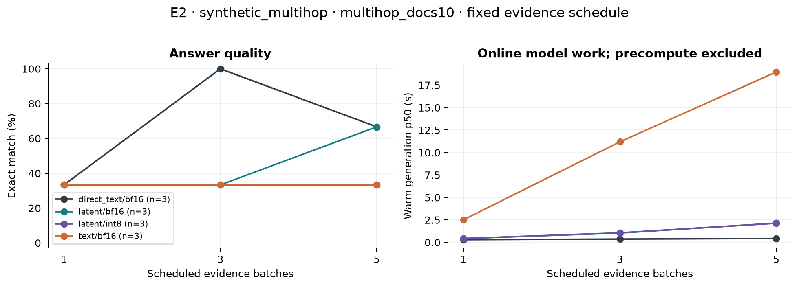
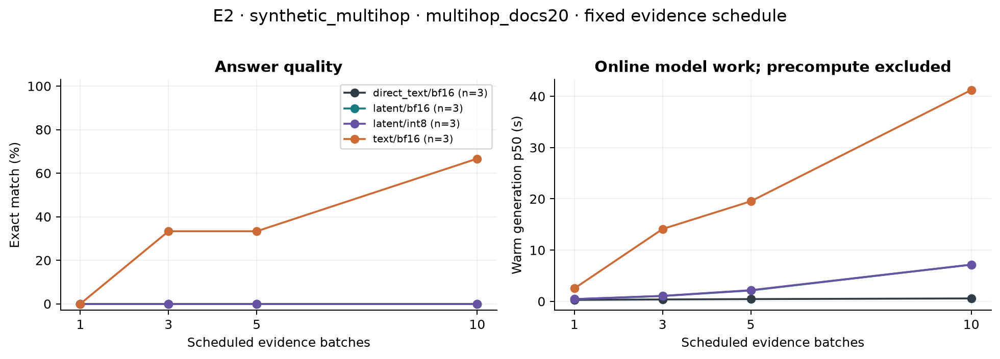
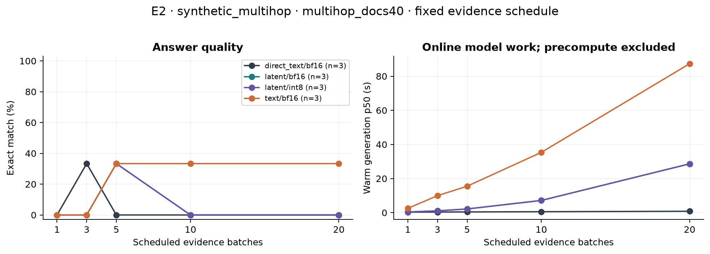
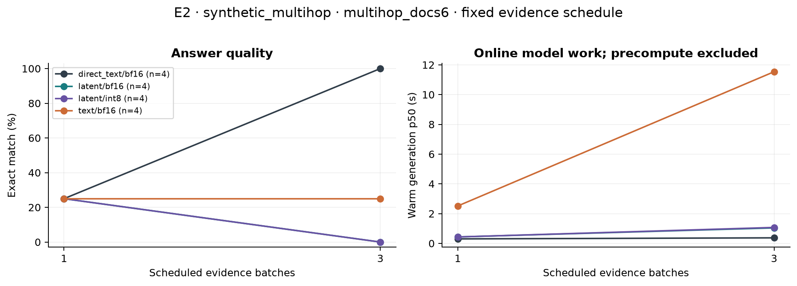
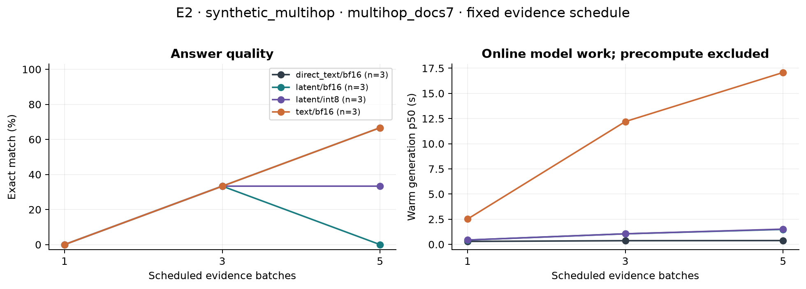
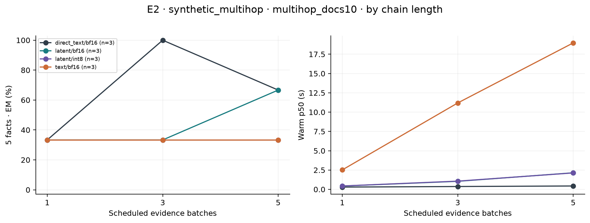
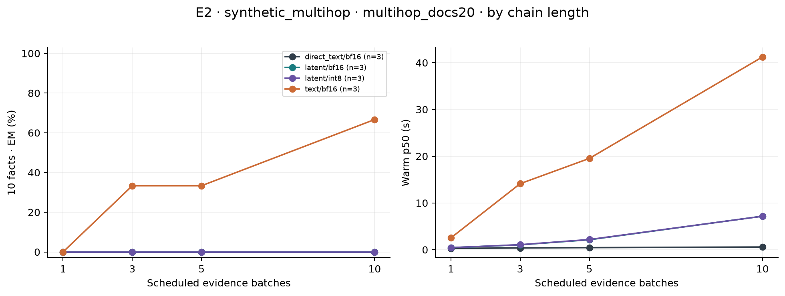
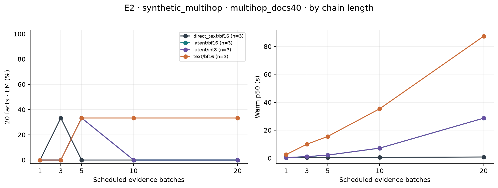
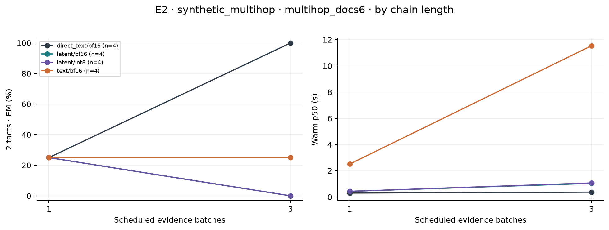
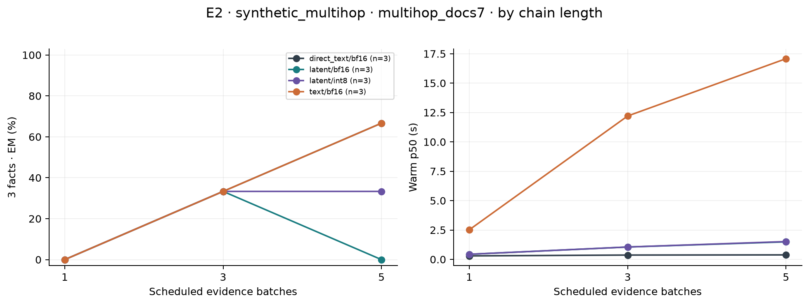
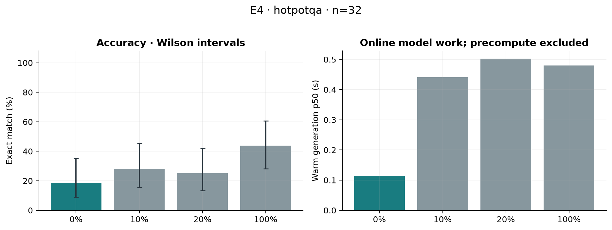
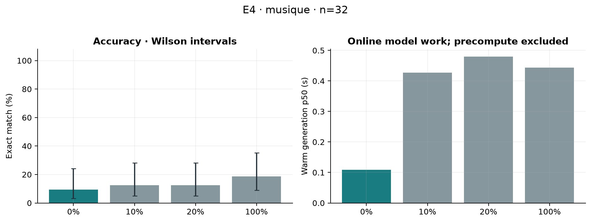
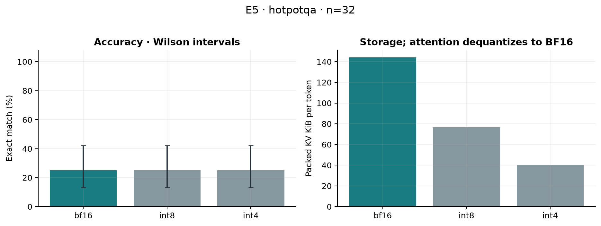
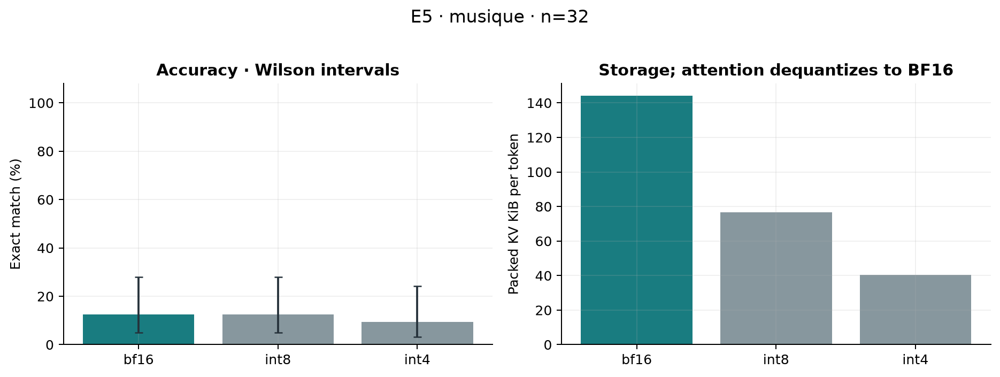
